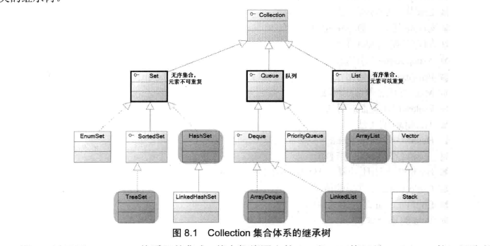

# java集合

## 定义

对象的可变数组，是一种常用的数据结构，可以实现栈队列等，还有一些具有映射关系的关联数组

java集合类主要由两个接口派生而出：Collection，Map

他们石java集合框架的跟接口，两个接口包含了一些子接口以及实现类。

下面是Collection的继承树：

下面是Map的集合树：

## Collection

常用方法：

查看当前数据个数：

int size\(\)：数据个数

boolean isEmpty\(\)：是否排空，空为true

新增：

boolean add\(Object O\)：添加数据，成功返回true

boolean addAll\(Collection c\)：添加数据，成功返回true

删除：

boolean remove\(Object O\)：删除数据，成功返回true

boolean removeAll\(Collection c\)：删除所有数据，成功返回true

boolean retainAll\(Collection c\)：删除非集合c中的数据，取两者交集，成功返回true

boolean clear\(\)：清空集合

查找：

boolean contains\(Object O\)：是否包含对象

boolean containsAll\(Collection c\)：是否包含集合

转换：

Iterator iterator\(\)：转换成迭代器

Object\[\] toArray\(\)：把集合转化成一个数组

## List

描述：有序，重复的集合

ArrayList  
Vector  
LinkedList

性能间的比较：

## Set

描述：无序，不可重复的集合

常用的集合：

HashSet：快速找到值  
--&gt;LinkedHashSet：记录插入顺序，查找性能略低，但是迭代访问有很好的性能  
SortedSet（接口）--&gt;TreeSet：可以排序的

EnumSet

性能间的比较：

## Map

描述：有映射关系的集合  
Hashtable  
HashMap  
--&gt;LinkedHashMap  
SortedMap（接口）--&gt;TreeMap

EnumMap

性能间的比较：

## Queue

队列  
Deque--&gt;ArrayDeque

Collection是Set，Queue，List的父接口

## 问题

### 1.HashTable和HashMap区别

1. 继承不同。  
   public class Hashtable extends Dictionary implements Map public class HashMap extends AbstractMap implements Map

2. Hashtable中的方法是同步的，而HashMap中的方法在缺省情况下是非同步的。在多线程并发的环境下，可以直接使用Hashtable，但是要使用HashMap的话就要自己增加同步处理了。

3. Hashtable中，key和value都不允许出现null值。在HashMap中，null可以作为键，这样的键只有一个；可以有一个或多个键所对应的值为null。当get\(\)方法返回null值时，即可以表示HashMap中没有该键，也可以表示该键所对应的值为null。因此，在HashMap中不能由get\(\)方法来判断HashMap中是否存在某个键，而应该用containsKey\(\)方法来判断。

4. 两个遍历方式的内部实现上不同。Hashtable、HashMap都使用了Iterator。而由于历史原因，Hashtable还使用了Enumeration的方式 。

5. 哈希值的使用不同，HashTable直接使用对象的hashCode。而HashMap重新计算hash值。

6. Hashtable和HashMap它们两个内部实现方式的数组的初始大小和扩容的方式。HashTable中hash数组默认大小是11，增加的方式是 old\*2+1。HashMap中hash数组的默认大小是16，而且一定是2的指数。

链接： [https:\/\/www.nowcoder.com\/questionTerminal\/c5e932bcec3a46cbb9976eea0783e555](https://www.nowcoder.com/questionTerminal/c5e932bcec3a46cbb9976eea0783e555)

来源：牛客网

