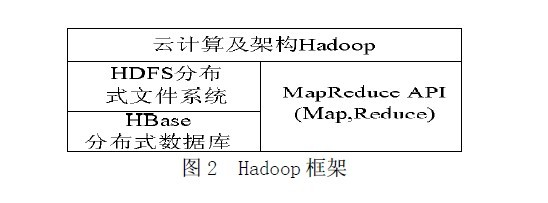
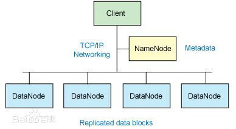
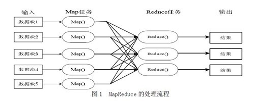

# Hadoop
## 定义
Hadoop是一个由Apache基金会所开发的分布式系统基础架构。

Hadoop的框架最核心的设计就是：HDFS和MapReduce。HDFS为海量的数据提供了存储，则MapReduce为海量的数据提供了计算。

## 背景
Hadoop原本来自于谷歌一款名为MapReduce的编程模型包。谷歌的MapReduce框架可以把一个应用程序分解为许多并行计算指令，跨大量的计算节点运行非常巨大的数据集。使用该框架的一个典型例子就是在网络数据上运行的搜索算法。Hadoop最初只与网页索引有关，而后迅速发展成为分析大数据的领先平台。

## 优点
- 高可靠性。Hadoop按位存储和处理数据的能力值得人们信赖。
- 高扩展性。Hadoop是在可用的计算机集簇间分配数据并完成计算任务的，这些集簇可以方便地扩展到数以千计的节点中。
- 高效性。Hadoop能够在节点之间动态地移动数据，并保证各个节点的动态平衡，因此处理速度非常快。
- 高容错性。Hadoop能够自动保存数据的多个副本，并且能够自动将失败的任务重新分配。
- 低成本。与一体机、商用数据仓库以及QlikView、Yonghong Z-Suite等数据集市相比，hadoop是开源的，项目的软件成本因此会大大降低。

## 核心框架
Hadoop 由许多元素构成。其最底部是 Hadoop Distributed File System（HDFS），它存储 Hadoop 集群中所有存储节点上的文件。HDFS（对于本文）的上一层是MapReduce 引擎，该引擎由 JobTrackers 和 TaskTrackers 组成。通过对Hadoop分布式计算平台最核心的分布式文件系统HDFS、MapReduce处理过程，以及数据仓库工具Hive和分布式数据库Hbase的介绍，基本涵盖了Hadoop分布式平台的所有技术核心。

### 组成
我们已经知道，Hadoop是Google的MapReduce一个Java实现。MapReduce是一种简化的分布式编程模式，让程序自动分布到一个 由普通机器组成的超大集群上并发执行。Hadoop主要由HDFS、MapReduce和HBase等组成。具体的hadoop的组成如下图：

### HDFS

### MapReduce
如下图所示，mapreduce模式的主要思想是将自动分割要执行的问题（例如程序）拆解成map（映射）和reduce（化简）的方式，流程图如下图1所示：

