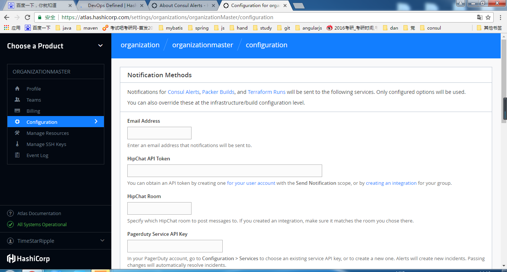

# Consul

## 介绍

### 定义

Consul是一个支持多数据中心分布式高可用的服务发现和配置共享的服务软件，是由HashiCorp公司用Go语言开发的，基于Mozilla Public License 2.0的协议开源的。

### 特性

1. 服务发现：Consul的客户端可以提供服务，如`api`或者`mysql`，并且其他客户端可以找到一个给定服务的提供者。使用DNS或HTTP，应用程序可以轻松找到它们所依赖的服务。可以知道当前服务的状态，用于做监控。

2. 健康检查：客户端会检查当前注册的服务的健康状态，监测集群是否存活

3. 键/值存储：服务器端把数据采用键值的方式存储，数据包括动态配置，功能的标记，集群节点的一致性协调，consul主节点选举

4. 多数据中心：支持任意数量数据中心。每个数据中心都有一个集群。

### 实现Devops功能
下面有多种不同的理解方式
1.consul的使用贯穿了整个Devops流程，为Devops中的每一个技术提供服务发现以及配置共享的功能

consul在部署基础框架时，为其他技术进行服务发现，并且对服务进行健康检查，降低运行时配置故障而导致生产时节点不正常的风险

在Atlas工作流中，Consul在Packer构建阶段配置，并标识每个工件中包含的服务，由于Consul在构建阶段使用Packer进行配置，因此当使用Terraform部署工件时，它会完全配置已预先定义的依赖关系和服务发现。

2.consul作为devops的最后一步，负责对运行环境的监控，包括健康检查以及服务发现


### 应用举例
 - docker 实例的注册与配置共享
 - coreos 实例的注册与配置共享
 - vitess 集群
 - SaaS 应用的配置共享
 - 与 confd 服务集成，动态生成 nginx 和 haproxy 配置文件

### 组成


- client：接收请求并转发给请求响应的server端，并且进行健康检查
- server：存储数据
- agent：代理有两种运行模式，一种是客户端，另一种是服务器，每个节点（包括客户端，服务端以及提供服务给consul的节点）都会运行代理，代理可以代理客户端也可以代理服务器端，所以说服务端和客户端都是又代理采用不同模式得到的。作为代理和提供服务者进行通信，负责维护成员信息，注册服务，健康检查，响应查询

### 版本
#### 企业版
企业版将在2017年3月7日被弃用，官方建议采用替代品，当然也可以继续使用，企业版将放入个人版中继续使用
企业版主要是一个线上的consul集群管理系统，帮助管理自己的consul集群，界面如下：

我们在使用部分中，会详细介绍企业版的功能

#### 个人版
个人版是在开源的web UI系统，帮助管理自己的consul集群，界面如下：

我们在使用部分中，会详细介绍个人版的功能


## 安装

### Mac OS 安装
```
brew install consul
```

### Ubuntu 安装

#### 安装所需
```
$ sudo apt-get install -y wget
$ sudo apt-get install -y unzip
$ sudo apt-get install -y vim
```

#### 下载consul
下载consul到` /usr/local/bin/`当中，也就是ubuntu的`path`,这样可以使用consul执行命令
```
$ wget https://releases.hashicorp.com/consul/0.7.2/consul_0.7.2_linux_amd64.zip
$ unzip consul_0.7.2_linux_amd64.zip
$ sudo mv consul /usr/local/bin/consul
```

#### 验证安装
```
$ consul
usage: consul [--version] [--help] <command> [<args>]

Available commands are:
    agent          Runs a Consul agent
    event          Fire a new event
    exec           Executes a command on Consul nodes
    force-leave    Forces a member of the cluster to enter the "left" state
    info           Provides debugging information for operators
    join           Tell Consul agent to join cluster
    keygen         Generates a new encryption key
    leave          Gracefully leaves the Consul cluster and shuts down
    members        Lists the members of a Consul cluster
    monitor        Stream logs from a Consul agent
    reload         Triggers the agent to reload configuration files
    version        Prints the Consul version
    watch          Watch for changes in Consul
```
运行结果如上，安装成功

#### 运行测试
**consul有三种运行方式：**

Sever 模式，快捷配置：（一般用于调试模式，正式环境不建议使用）
```
$ consul agent -dev
```

Sever 模式：
```
$ consul agent -server -bootstrap-expect 1 -data-dir /tmp/consul -ui  -config-dir /etc/consul.d -advertise 192.168.202.128 -client 192.168.202.128
```
这里可以在在浏览器中使用http://192.168.202.128:8500查看界面效果
注：请替换上面的ip为当前宿主机ip

Client 模式：
```
$ consul agent -data-dir /tmp/consul -node=ubuntu64 -bind=192.168.202.128
```
因为客户端必须要有服务端，所以单独的客户端会一直报错，找不到服务端

配置参数说明：
- -server：- Serve 模式（不配置为 Client 模式），数量一般为 3-5 个
- -bootstrap-expect： - Server 数量
- -data-dir： - 数据目录
- -ui：使用自带目录显示
- -ui-dir： - UI目录
- -node： - Node名称
- -advertise：设置广播地址,ip可以设置为公网ip
- -client：设置client访问的地址
- -bind： - 集群通讯地址

其他命令：

- `consul members`：查看集群成员
- `consul info`：查看当前服务器的状况
- `consul leave`：退出当前服务集群
- `ctrl + c`：停止服务

`consul members`命令示例：（在3个server下，3个agent下的展示结果）
```
Node                Address            Status  Type    Build  Protocol  DC
server1.consul.com  200.21.1.101:8301  alive   server  0.5.2  2         dc1
agent1.consul.com   200.21.1.201:8301  alive   client  0.5.2  2         dc1
agent2.consul.com   200.21.1.202:8301  alive   client  0.5.2  2         dc1
server2.consul.com  200.21.1.102:8301  alive   server  0.5.2  2         dc1
server3.consul.com  200.21.1.103:8301  alive   server  0.5.2  2         dc1
agent3.consul.com   200.21.1.203:8301  alive   client  0.5.2  2         dc1
```

## 功能使用

### 注册服务

#### 定义服务
首先，为Consul配置创建一个目录。Consul装载配置目录中所有的配置文件，通常在Unix系统中惯例是建立以名为 `/etc/consul.d` 的目录（ .d 后缀暗示这个目录包含了一些配置文件的集合）。
```
$ sudo mkdir /etc/consul.d
```

下一步，我们将创建一个服务定义配置文件。我们假设我们有一个名为“web"服务，它运行在80端口。另外我们为它设置一个标记，那么我们就可以通过它来查询到这个服务：
```
$ echo '{"service": {"name": "web", "tags": ["rails"], "port": 80}}' \
    >/etc/consul.d/web.json
```

现在，我们重启代理，并提供配置目录参数：
```
$ consul agent -dev -config-dir /etc/consul.d
==> Starting Consul agent...
...
    [INFO] agent: Synced service 'web'
...
```

你会注意到在输出中"synced service 'web'"。这意味着代理已经从配置文件中装载了该服务定义，并且已经成功注册该服务到服务目录中。

如果你想注册多个服务，你可以在Consul配置目录中创建多个服务定义文件。

#### 查询服务
一旦代理启动并且服务已经同步，我们就可以使用DNS或者HTTP API来查询服务了。

##### DNS API
让我们首先使用DNS API查询我们的服务。对于DNS API，服务的DNS名称是 NAME.service.consul 。默认所有的DNS名称都是在 consul 名称空间下，当然这个是可配置的。service 子域名告诉Consul我们正在查询服务，并且 NAME 就是要查询的服务的名称。

对于我们注册的web服务，对应的查询设置就是 web.service.consul ：
```
$ dig @127.0.0.1 -p 8600 web.service.consul
...

;; QUESTION SECTION:
;web.service.consul.        IN  A

;; ANSWER SECTION:
web.service.consul. 0   IN  A   172.20.20.11
```
你可以看到，一个带了节点的IP地址的 A 记录被返回了，它就是可用的服务。 A 记录只能包含IP地址。

你也可以使用DNS API来获取完整的地址/端口的 SRV 记录：

```
$ dig @127.0.0.1 -p 8600 web.service.consul SRV
...

;; QUESTION SECTION:
;web.service.consul.        IN  SRV

;; ANSWER SECTION:
web.service.consul. 0   IN  SRV 1 1 80 Armons-MacBook-Air.node.dc1.consul.

;; ADDITIONAL SECTION:
Armons-MacBook-Air.node.dc1.consul. 0 IN A  172.20.20.11
```
SRV 记录显示了web服务证运行在节点 Armons-MacBook-Air.node.dc1.consul. 的80端口上。额外的部分和 A 记录返回的内容一样。

最后，我们可以使用DNS API基于标记来过滤服务，基于标记的服务查询的格式是 TAG.NAME.service.consul 。 在下面的例子里，我们请求Consul查询所有含"rails"标记的web服务。我们得到了我们注册的带有该标记的服务的响应：

```
$ dig @127.0.0.1 -p 8600 rails.web.service.consul
...

;; QUESTION SECTION:
;rails.web.service.consul.      IN  A

;; ANSWER SECTION:
rails.web.service.consul.   0   IN  A   172.20.20.11
```

##### HTTP API
除了DNS API，HTTP API也可以用于服务查询：
```
$ curl http://localhost:8500/v1/catalog/service/web
[{"Node":"Armons-MacBook-Air","Address":"172.20.20.11","ServiceID":"web", \
    "ServiceName":"web","ServiceTags":["rails"],"ServicePort":80}]
```

该目录API返回了指定节点以及指定的服务信息。就像我们马上要看到了健康检测，通常我们的查询只是查询那些健康的实例，这些实例都是通过了健康检测的。这也是DNS在底层做的事情。下面的查询只查询健康的实例：
```
$ curl 'http://localhost:8500/v1/health/service/web?passing'
[{"Node":"Armons-MacBook-Air","Address":"172.20.20.11","Service":{ \
    "ID":"web", "Service":"web", "Tags":["rails"],"Port":80}, "Checks": ...}]
```

#### 更新服务
当配置文件修改后服务定义可以被更新，需要发送 SIGHUP 信号给代理。这可以让代理更新服务而无需停止代理或者让服务查询时服务不可用。

可以选择HTTP API来动态地增加，删除，以及更改服务。


### 健康检查

#### 定义检测
类似于服务，可以通过一个 检测定义或者通过调用HTTP API来注册一个检测。

我们将使用检测定义的方法，因为就像服务一样，使用定义是一个最为常用的方法来设置检测。

在第二个节点的Consul配置目录中创建两个定义文件：
```
vagrant@n2:~$ echo '{"check": {"name": "ping",
  "script": "ping -c1 google.com >/dev/null", "interval": "30s"}}' \
  >/etc/consul.d/ping.json

vagrant@n2:~$ echo '{"service": {"name": "web", "tags": ["rails"], "port": 80,
  "check": {"script": "curl localhost >/dev/null 2>&1", "interval": "10s"}}}' \
  >/etc/consul.d/web.json
```

第一个定义增加了一个主机级别的检测，名为"ping"。该检测每30秒间隔运行一次，调用命令 ping -c1 google.com。在一个基于脚本的健康检测中，该检测使用启动Consul进程的用户来启动该检测。如果检测命令返回一个非0的返回码，那么该节点将被标记为不健康。这就是任何基于 脚本 的健康检测的契约。

第二个命令修改名为 web 的服务，增加了一个检测，该检测每10秒用curl发送一个请求来验证该web服务是否可用。就像基于主机的健康检测，如果脚本返回一个非0的返回码，那该服务将被标记为不健康。

现在重启第二个代理或者向它发送一个 SIGHUP 信号。你会看到下列日志信息：
```
==> Starting Consul agent...
...
    [INFO] agent: Synced service 'web'
    [INFO] agent: Synced check 'service:web'
    [INFO] agent: Synced check 'ping'
    [WARN] Check 'service:web' is now critical
```

前面的几行指出该代理已经同步了新的定义。后面的几行指出了被检测的 web 服务被标记为危险。这是因为我们还没有实际运行一个web服务器，所以这个curl测试标记为失败了。

#### 检测健康状态
现在我们已经增加了一些检测，我们可以使用HTTP API来审查它们。首先，我们可以使用命令寻找任何失败的检测（注意，这个命了可以在任何节点上运行）：
```
vagrant@n1:~$ curl http://localhost:8500/v1/health/state/critical
[{"Node":"agent-two","CheckID":"service:web","Name":"Service 'web' check","Status":"critical","Notes":"","ServiceID":"web","ServiceName":"web"}]
```

我们可以看到现在只有一个检测，那是我们的 web 服务的检测，它被设置为危险状态。

另外，我们可以尝试使用DNS查询web服务。Consul不会返回任何结果因为该服务是不健康的：

```
dig @127.0.0.1 -p 8600 web.service.consul
...

;; QUESTION SECTION:
;web.service.consul.        IN  A
```


### 键/值对数据
为了展示存储键／值对是非常简单的，我们将在键／值存储里维护一些键。

我们在运行代理步骤中展示了查询本地代理，我们先验证键／值存储中没有任何键存在：
```
$ curl -v http://localhost:8500/v1/kv/?recurse
* About to connect() to localhost port 8500 (#0)
*   Trying 127.0.0.1... connected
> GET /v1/kv/?recurse HTTP/1.1
> User-Agent: curl/7.22.0 (x86_64-pc-linux-gnu) libcurl/7.22.0 OpenSSL/1.0.1 zlib/1.2.3.4 libidn/1.23 librtmp/2.3
> Host: localhost:8500
> Accept: */*
>
< HTTP/1.1 404 Not Found
< X-Consul-Index: 1
< Date: Fri, 11 Apr 2014 02:10:28 GMT
< Content-Length: 0
< Content-Type: text/plain; charset=utf-8
<
* Connection #0 to host localhost left intact
* Closing connection #0
```
因为没有任何键，所以我们得到了404的响应，我们可以用 PUT 来存储一些键：

```
$ curl -X PUT -d 'test' http://localhost:8500/v1/kv/web/key1
true
$ curl -X PUT -d 'test' http://localhost:8500/v1/kv/web/key2?flags=42
true
$ curl -X PUT -d 'test'  http://localhost:8500/v1/kv/web/sub/key3
true
$ curl http://localhost:8500/v1/kv/?recurse
[{"CreateIndex":97,"ModifyIndex":97,"Key":"web/key1","Flags":0,"Value":"dGVzdA=="},
 {"CreateIndex":98,"ModifyIndex":98,"Key":"web/key2","Flags":42,"Value":"dGVzdA=="},
 {"CreateIndex":99,"ModifyIndex":99,"Key":"web/sub/key3","Flags":0,"Value":"dGVzdA=="}]
```
这里我们创建了3个键，每个都关联了值"test"。注意 值 字段的返回是基于base64的编码，该编码允许非UTF8字符集。对于键"web/key2"，我们为其设置了一个42的 标记。所有的键都支持设置一个64位长的整形标记值。这个标记并不是由Consul内部使用的，它可以被用于存储任意键值对的元数据信息。

在设置值之后，我们使用 ?recurse 参数发出了 GET 请求来接收多个键的信息。

你也可以非常容易地获取单个键的信息：

```
$ curl http://localhost:8500/v1/kv/web/key1
[{"CreateIndex":97,"ModifyIndex":97,"Key":"web/key1","Flags":0,"Value":"dGVzdA=="}]
```
删除一个键也同样非常简单，使用 DELETE 来删除一个键。我们可以指定完整路径来删除单独一个键，或者使用"?recurse"递归删除所有的键：

```
$ curl -X DELETE http://localhost:8500/v1/kv/web/sub?recurse
$ curl http://localhost:8500/v1/kv/web?recurse
[{"CreateIndex":97,"ModifyIndex":97,"Key":"web/key1","Flags":0,"Value":"dGVzdA=="},
 {"CreateIndex":98,"ModifyIndex":98,"Key":"web/key2","Flags":42,"Value":"dGVzdA=="}]
```
使用一个 PUT 请求相同的URI并且提供一个不同的消息体就可以修改指定的键，Consul提供了一个 检测并设置 的操作，对应的操作是原子的。通过在GET请求中提供 ?cas= 参数以及指定最新的 ModifyIndex 值我们就可以得到原子CAS操作。例如，假设我们想要更新"web/key1"：

```
$ curl -X PUT -d 'newval' http://localhost:8500/v1/kv/web/key1?cas=97
true
$ curl -X PUT -d 'newval' http://localhost:8500/v1/kv/web/key1?cas=97
false
```
这里，第一个CAS更新成功了因为最新的 ModifyIndex 是97，而第二个操作失败了因为最新的 ModifyIndex 不再是97了。

我们可以使用 ModifyIndex 来等待指定键值的改变，例如，假设我们想要等待Key2的修改：

```
$ curl "http://localhost:8500/v1/kv/web/key2?index=101&wait=5s"
[{"CreateIndex":98,"ModifyIndex":101,"Key":"web/key2","Flags":42,"Value":"dGVzdA=="}]
```
通过提供"?index="参数，我们请求等待直到键包含了一个大于101的 ModifyIndex 的值。无论如何由于"?wait=5"参数限制了查询最多等待5秒，之后会返回当前没有修改的值。该操作可以高效地等待键的更新。另外相同的方法可以用于等待一个键的集合，直到键集合中任何一个键发生的更新。

## 集群使用
consul的客户端管理平台有两个版本，一个是企业版和普通版，我在这里会使用[Vagrant](https://www.vagrantup.com/)启动两个节点的集群，有一个客户端和一个服务器端，在最后会讲到2个版本的不同使用。接下来使用的Vagrantfile可以在[Consul仓库demo](https://github.com/hashicorp/consul/tree/master/demo/vagrant-cluster)中找到。

### 运行节点

我们首先启动两个节点：
```
$ vagrant up
```

一旦该系统可用了，我们就能通过ssh登录到该系统，并开始配置我们的集群。我们开始登录到第一个节点：
```
$ vagrant ssh n1
```

在第一个节点中启动服务器端：
```
vagrant@n1:~$ consul agent -server -bootstrap-expect 1 \
    -data-dir /tmp/consul -node=agent-one -bind=172.20.20.10 \
    -config-dir /etc/consul.d
```

现在，在另一终端里，我们连接到第二个节点：
```
$ vagrant ssh n2
```

在第二个节点中启动客户端：
```
vagrant@n2:~$ consul agent -data-dir /tmp/consul -node=agent-two \
    -bind=172.20.20.11 -config-dir /etc/consul.d
```
注：如果要启动时自动加入一个集群，请在命令后面加上`-join <ip>`

这时，我们已经有了两个Consul代理在运行：一个服务器和一个客户端。这两个Consul代理现在还对彼此没有任何感知，它们都为两个单节点的集群。你可以运行 consul members 来验证它们，每个集群都仅包含一个成员。

### 加入集群
现在，我们将告知第一个代理加入第二个代理，在一个新的终端中运行下列命令：
```
$ vagrant ssh n1
...
vagrant@n1:~$ consul join 172.20.20.11
Successfully joined cluster by contacting 1 nodes.
```

你应该可以在各自的代理日志中看到一些日志的输出。如果你仔细的查看，你将会看到有节点加入的日志信息。如果你再次运行 consul members，你会看到两个代理都已经感知到了另一个节点的存在。

```
vagrant@n2:~$ consul members
Node       Address            Status  Type    Build  Protocol
agent-two  172.20.20.11:8301  alive   client  0.5.0  2
agent-one  172.20.20.10:8301  alive   server  0.5.0  2
```

如果要退出集群，可以直接使用`Ctrl-C`退出

> 注：为了加入一个集群，一个Consul代理只需要知道一个现有的成员。在加入指定的集群后，各个代理会互相传播完整的成员信息。

### WEB UI 展示

#### 企业版

你必须在你的配置中增加两个字段来设置使用Atlas界面：你Atlas infrastructure的名字以及你的Atlas token。下面的例子就是在调用Consul代理的命令行中提供这些设置：
```
consul agent -atlas=ATLAS_USERNAME/demo -atlas-token="ATLAS_TOKEN"
```
为了取得一个Atlas用户名和token，创建一个[账号](https://atlas.hashicorp.com/account/new?utm_source=oss&utm_medium=getting-started-ui&utm_campaign=consul)并且在Consul配置中使用你的凭证值来替换这些上面各自的值。

为了使得本地节点能在启动时，直接连入atlas集群，请加上上面两个配置以及`-atlas-join`。

以上面的集群为例，重新启动两个节点，服务器端的命令加上`-atlas=ATLAS_USERNAME/demo -atlas-token="ATLAS_TOKEN" -atlas-join`。客户端命令删去`-join`，加上`-atlas=ATLAS_USERNAME/demo -atlas-token="ATLAS_TOKEN" -atlas-join`。

**访问https://atlas.hashicorp.com/consul，界面如下：**

选中中间的集群，点击进入

**集群的UI界面如下：**

1. 主界面有`Services`，`Nodes`以及`K/V`三个选项，分别查看服务，节点以及键值对的情况。

2. 最上面有个警告提示窗口，告诉你一个健康检查有一些问题。

**ACL界面如下：**

这个界面只能在选择最上面两个菜单的时候能够看得到，ACL用于访问控制，为KV存储，服务注册，服务发现，用户事件，加密秘钥进行控制

**命令提示界面如下：**

这里会提示你如何写连入集群的命令

**设置界面如下：**

这里是设置集群的用户访问权限以及删除环境

**提示信息界面如下：**

可以设置提示信息，当Atlas不在和集群通信的时候显示

**提示信息方式界面如下：**

可以设置4种提示方式，包括Slack, email, HipChat and Pagerduty.

**用户授权界面如下：**

可以创建一个用户并给其赋予访问当前集群UI的各种权限

**日志界面如下：**

这里显示了一些操作日志

右边菜单栏有一个environment标签，代表当前账号有多少环境，每一个环境管理一个的consul集群


**注：企业版预计在2017年3月7日将弃用，到时企业版将会作为私有版本放入二进制文件当中使用，当然官方也有替换其他产品的说明，请参考https://atlas.hashicorp.com/help/consul/alternatives**

#### 普通版本
重新启动Consul代理并在命令最后设置 -ui 参数来启动自有主机的界面：
```
consul agent -ui
```
该界面被映射到 `/ui `HTTP路径上，和HTTP API使用相同的端口。默认下就是 `http://localhost:8500/ui`，如果这里不修改的话，就只能通过localhost来访问，不能写ip访问。

为了访问Web UI，可以通过新建一个ssh隧道，本机的8500端口引向客户机的8500
```
# 密码为vagrant
ssh -N -f -L 8500:localhost:8500 vagrant@n2
```
如果不想要用localhost的话，请在命令后面加上`-client 0.0.0.0`

**注：-client 0 0 0 0 -ui-->使得客户端可以直接通过url访问服务端的consul ui**

你可以在这里浏览到[Consul Web界面在线的演示](http://demo.consul.io/)。

普通版本功能说明如下：

services代表当前consul集群所注册了多少个服务，consul是默认自带的，web是后面配置的


nodes代表当前节点的情况，包括磁盘利用率，负载均衡，健康检查（是否存活，是否能和集群交流）


key/value代表当前集群存储的键值对


ACL是访问控制界面，为KV存储，服务注册，服务发现，用户事件，加密秘钥进行控制

上面菜单栏中的`DC1`，代表的是选择的数据中心，点击可以产生列表进行选择


访问控制

#### 两者间的异同
相同点：两者其实都是UI，管理consul集群的。
不同点：企业版拥有报警功能，企业版拥有自动添加节点的功能，不需要知道其他节点的位置；企业版UI展示的内容比普通版本要少得多，只有一个健康状况（包括服务和节点）

## 实现
一致性协议采用 Raft 算法,用来保证服务的高可用.
成员管理和消息广播 采用GOSSIP协议，支持ACL访问控制。

ACL技术在路由器中被广泛采用，它是一种基于包过滤的流控制技术。控制列表通过把源地址、目的地址及端口号作为数据包检查的基本元素，并可以规定符合条件的数据包是否允许通过。

gossip就是p2p协议。他主要要做的事情是，去中心化。
这个协议就是模拟人类中传播谣言的行为而来。首先要传播谣言就要有种子节点。种子节点每秒都会随机向其他节点发送自己所拥有的节点列表，以及需要传播的消息。任何新加入的节点，就在这种传播方式下很快地被全网所知道。

以上待深入研究

## 总结
1. zookeeper和consul比较类似，zookeeper提供一致性服务的，也是通过注册服务，服务提供者可以连接整个zookeeper集群，通过zookeeper集群管理服务提供者的集群。两者不同点在于consul有客户端，并且zookeeper需要构建自己的系统来发现服务，以及一致性算法不相同。

2. 多数据中心的意义在于能够在不同区域都提供最佳的应用性能，减少延迟等待时间。因为在一个数据中心的节点是在一个局域网内的，作为一个集群，而不同数据中心分布在不同的区域提供服务。

## 参考文献

- 官网：https://www.consul.io
- Consul入门07 － Consul Web界面： https://segmentfault.com/a/1190000005087783
- 服务发现系统之consul入门：http://www.itnpc.com/news/web/1472101077107905.html
- 服务发现和注册工具consul简介：http://www.cnblogs.com/lazio10000/p/6126754.html
- How to Configure Consul in a Production Environment on Ubuntu 14.04：https://www.digitalocean.com/community/tutorials/how-to-configure-consul-in-a-production-environment-on-ubuntu-14-04#prerequisites-and-goals
