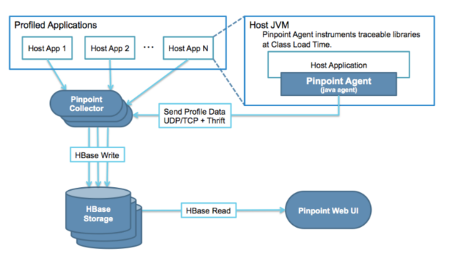

#pinpoint
##pinpoint介绍
###背景（APM定义）
>In the fields of information technology and systems management, Application Performance Management (APM) is the monitoring and management of performance and availability of software applications. APM strives to detect and diagnose complex application performance problems to maintain an expected level of service. APM is “the translation of IT metrics into business meaning ([i.e.] value).”

APM监控和管理软件应用的性能和可用性，探测和诊断复杂的应用性能问题。
###pinpoint说明
>Pinpoint provides a solution to help analyze the overall structure of the system and how components within them are interconnected by tracing transactions across distributed applications.
Install agents without changing a single line of code
Minimal impact on performance (approximately 3% increase in resource usage)

Pinpoint能帮助分析整个系统架构，在分布式应用中通过追踪事务解释系统组件间是怎么进行连接的。

###pinpoint架构

如上图，Pinpoint由4部分组成：
1. Pinpoint Agent：放在监听的应用服务器当中，对应用进行监听，并发送数据给collector
2. Pinpoint Collector：接收从agent发出的数据，并进行汇总，写入数据库
3. Hbase：存储从collector发送过来的数据，对数据进行持久化
4. Pinpoint Web UI：将hbase中的数据提取出来，在界面中展示

其中2,4必须使用web容器。
Pinpoint使用了字节码增强技术，在类加载时，注入到观察的应用Class文件中。
所以在启动应用时，必须设置-javaagent为Pinpoint的agent。

###pinpoint支持的模块
>JDK 6+
Tomcat 6/7/8, Jetty 8/9
spring, Spring Boot
Apache HTTP Client 3.x/4.x, JDK HttpConnector, GoogleHttpClient, OkHttpClient, NingAsyncHttpClient
Thrift Client, Thrift Service
MySQL, Oracle, MSSQL, CUBRID, DBCP, POSTGRESQL
Arcus, Memcached, Redis
iBATIS, MyBatis
gson, Jackson, Json Lib
log4j, Logback

##pinpoint安装配置
>以下配置全部基于ubuntu

###安装前提
**1.jdk1.7，jdk1.8，jdk1.6（可以用7代替）**
**2.hbase**
**3.maven3.2版本以上**

###安装方式
>docker镜像安装
war包直接安装
源码安装

####docker镜像安装
需要先安装docker，详情请查看docker文档
然后进入如下链接，里面有安装运行详细文档
[docker hub下载](https://hub.docker.com/r/yous/pinpoint/)

####war包直接安装
#####1.安装hbase（v1.1.5）
```
wget http://mirrors.hust.edu.cn/apache/hbase/1.1.5/hbase-1.1.5-bin.tar.gz
```
直接解压然后 运行bin下面的start-hbase.sh(如果没有配置过jdk环境变量，需要配置hbase-env.sh中的jdk path)

#####2.安装pinpoint（v1.5.2）
直接下载web、collector和agent的包
```
wget https://github.com/naver/pinpoint/releases/download/1.5.2/pinpoint-web-1.5.2.war
wget https://github.com/naver/pinpoint/releases/download/1.5.2/pinpoint-collector-1.5.2.war
wget https://github.com/naver/pinpoint/releases/download/1.5.2/pinpoint-agent-1.5.2.tar.gz
```
将web和collector分别放到web容器下，最好两个容器，我将web的端口设为28080，collector的端口设为28080，
如果hbase和web,collector在同一台机器，不需要任何配置，默认会去读本地的hbase zookeeper。

#####3.集成到应用
将agent放到app所在的服务器，然后再启动参数中加入
比如我现在用的是dubbo服务（最新的pinpoint已经支持了dubbo）
```
java  -javaagent:$AGENT_PATH/pinpoint-bootstrap-$VERSION.jar -Dpinpoint.agentId=$AGENT_ID  -Dpinpoint.applicationName=$APPLICATION_NAME
```
AGENT_PATH：agent存放的位置，
VERSION：我用的是1.5.2
AGENT_ID ：自定义。就是一个唯一标识
APPLICATION_NAME：自定义

如果是tomcat的话修改catalina.sh，添加-javaagent, -Dpinpoint.agentId, -Dpinpoint.applicationName 到 CATALINA_OPTS 参数里去。

#####4.应用测试
Web UI: http://localhost:28080
TestApp: http://localhost:28081

####源码安装
#####1.配置jdk
因为Pinpoint依赖JDK6,7,8; 所以必须配置JDK6,7,8环境变量
在/etc/profile 添加：
```
JAVA_6_HOME="/data1/hugang/jdk1.6.0_45"
export JAVA_6_HOME
JAVA_7_HOME="/usr/local/jdk"
export JAVA_7_HOME
JAVA_8_HOME="/data1/hugang/jdk1.8.0_71"
export JAVA_8_HOME
```
然后加载配置
```
source /etc/profile
```
#####2.下载源码（git）
有两种下载项目的方式
1.git克隆项目
`git clone https://github.com/naver/pinpoint.git`
2.wget直接下载
`wget https://github.com/naver/pinpoint/archive/1.6.0-RC2.tar.gz`
`wget https://github.com/naver/pinpoint/archive/1.5.2.tar.gz`

点击进入源码网址：[git源码网址](https://github.com/naver/pinpoint)

#####3.项目安装
1.打包项目，进入pinpoint文件目录，执行
```
mvn install -Dmaven.test.skip=true
```
^此处如果出错，试试修改JDK或者maven环境变量版本^

2.安装Hbase，在pinpoint/quickstart/hbase下，执行
```
../bin/start-hbase.sh
```

3.初始化Hbase
```
../bin/init-hbase.sh
```
#####4.项目运行
1.启动collector
```
sh start-collector.sh
```
2.启动webui
```
sh start-web.sh
```
3.启动测试APP
```
sh start-testapp.sh
```
#####5.界面展示
Web UI - http://localhost:28080
TestApp - http://localhost:28081

#####6.项目停止
HBase - Run `quickstart/bin/stop-hbase.sh`
Collector - Run `quickstart/bin/stop-collector.sh`
Web UI - Run `quickstart/bin/stop-web.sh`
TestApp - Run `quickstart/bin/stop-testapp.sh`

##pinpoint分布式监听使用
>前提是已经安装完成，并能监听自身demo

###运行主机
按照上面的命令执行

###给需要检测的应用配置agent
####配置监听
#####1.解释
将agent放到app所在的服务器，然后再启动参数中加入
比如我现在用的是dubbo服务（最新的pinpoint已经支持了dubbo）
```
java  -javaagent:$AGENT_PATH/pinpoint-bootstrap-$VERSION.jar -Dpinpoint.agentId=$AGENT_ID  -Dpinpoint.applicationName=$APPLICATION_NAME
```
AGENT_PATH：agent存放的位置，
VERSION：我用的是1.5.2
AGENT_ID ：自定义。就是一个唯一标识
APPLICATION_NAME：自定义

#####2.举例
如果是tomcat的话，要在bin/catalina.sh中添加-javaagent, -Dpinpoint.agentId, -Dpinpoint.applicationName 到 CATALINA_OPTS 参数里去。如下：

```
#pinpoint agent路径
CATALINA_OPTS="$CATALINA_OPTS -javaagent:/data1/hugang/pinpoint/pinpoint-agent-1.5.1/pinpoint-bootstrap-1.5.1.jar"
#被监控工程使用agent的标识号
CATALINA_OPTS="$CATALINA_OPTS -Dpinpoint.agentId=0000002"
#被监控工程名字
CATALINA_OPTS="$CATALINA_OPTS -Dpinpoint.applicationName=10.75.0.101_8086_自定义"
```

####配置数据发送
并且需修改pinpoint-agent的配置文件$AGENT_PATH/pinpoint.config，指定pinpoint Collector的ip
```
profiler.collector.ip=10.210.228.50
```

####运行应用
将应用运行

###界面测试
在web界面中查看结果

##学习总结
####经验
1.目前使用的版本只能支持到jdk1.7 需要在path中建JAVA_7_HOME这个环境变量
2.我将hbase当中的测试数据全部清除后, 然后调用被监控的接口，然后前端总是不显示agent的application信息，然后去查询agentinfo表，确实没有数据，但是，
agentStatus当中的表都有了数据，只有agentInfo表怎么都没有数据....折腾半天原来被监控的服务需要重启，才能将agent信息重新注册到hbase中。。。。。。
3.清除了hbase的data文件之后，通过hbase的list命令返回为空库，但是重新初始化pinpoint的表结构时，提示：表已存在，，，，，很奇怪，
最后发现，虽然删除了hbase的表数据，但是hbase的表都注册到zk中了，所以需要把zk中的数据也要清理掉......

